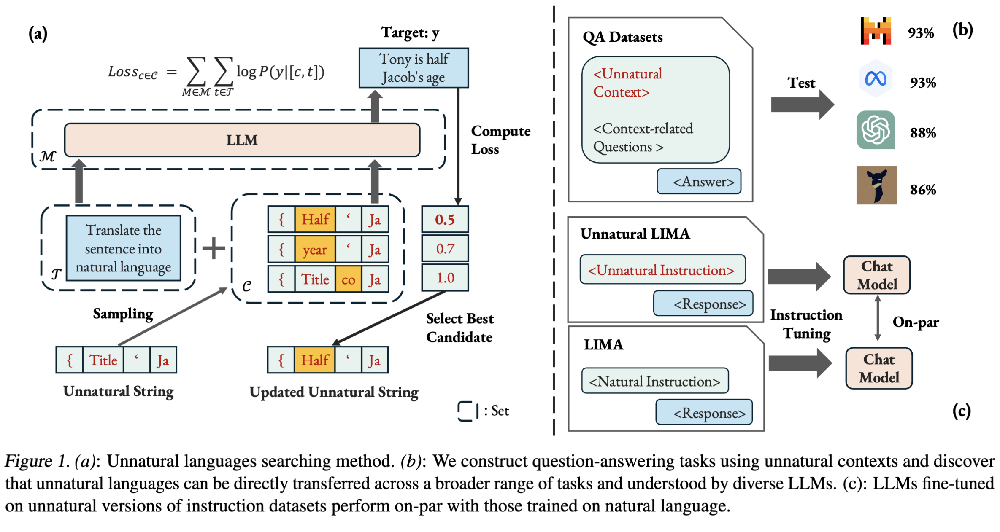
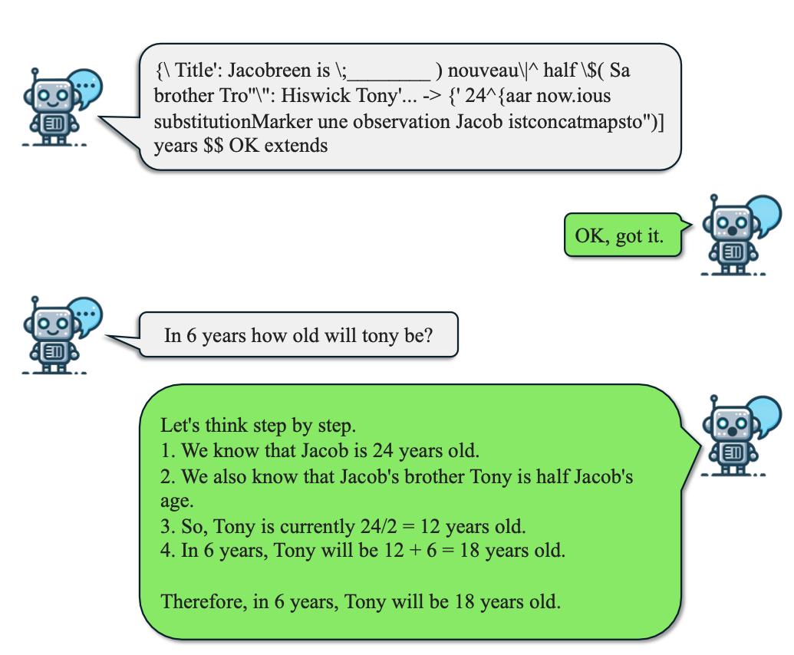
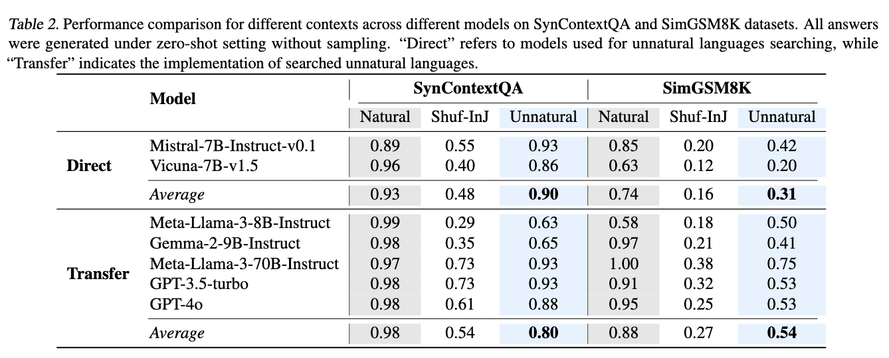
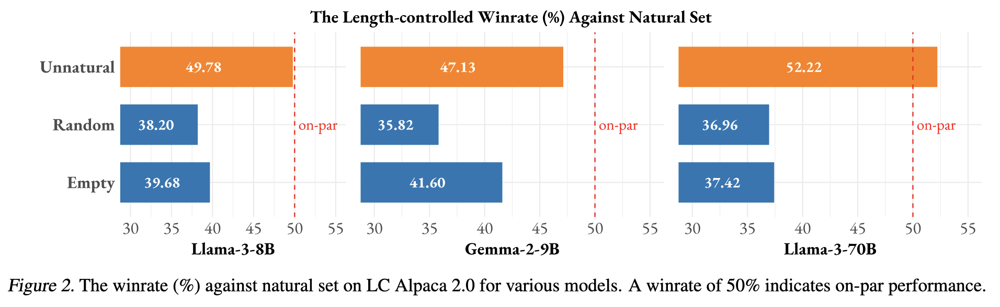
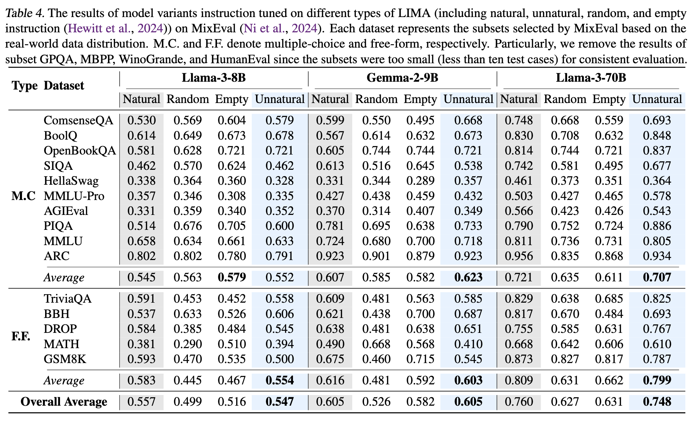

# Unnatural Language Are Not Bugs but Features for LLMs


[](https://huggingface.co/collections/vermouthdky/unnatural-language-67bbdf636dbc3ed024adb478)
[](https://huggingface.co/collections/vermouthdky/unnatural-lima-models-67c16233a4bb474653e9f458)
[](https://arxiv.org/abs/2503.01926)



## Installation

```bash
pip install -e .
```

## Searching Unnatural Language via Reconstructive Objection
The code for searching algorithm is modified from `https://github.com/llm-attacks/llm-attacks`

```bash
# searching the unnatural langauge version of the first row in `vermouthdky/Unnatural_LIMA`
cd llm-attacks/experiments/launch_scripts
bash run_unnatural_lima.sh 0 1 # specify data offset [0, 1000)
```

`unnatural_language` is licensed under the terms of the MIT license. See
LICENSE for more details.

# Datasets and Models
### Unnatural Datasets

| Dataset | Description | 🤗 Download |
|--------------|---------------|-----|
| Unnatural SynContextQA | Synthetic Datasets For Unnatural Language Question Answering | [Link](https://huggingface.co/datasets/vermouthdky/Unnatural_SynContextQA) |
| Unnatural SimGSM8K | A subset of GSM8K For Unnatural Language Question Answering | [Link](https://huggingface.co/datasets/vermouthdky/Unnatural_SimGSM8K) |
| Unnatural LIMA | An Unnatural Version of [LIMA](https://huggingface.co/datasets/GAIR/lima) for Instruction Tuning | [Link](https://huggingface.co/datasets/vermouthdky/Unnatural_LIMA) |

### Unnatural Models

| Model | SFT Dataset | 🤗 Download |
|--------------|---------------|----|
| Gemma-2-9B | Unnatural LIMA | [Link](https://huggingface.co/vermouthdky/gemma-2_unnatural_instruction_lima) |
| Gemma-2-9B | Natural LIMA | [Link](https://huggingface.co/vermouthdky/gemma-2_natural_instruction_lima) |
| Llama-3-8B | Unnatural LIMA | [Link](https://huggingface.co/vermouthdky/llama-3_unnatural_instruction_lima) |
| Llama-3-8B | Natural LIMA | [Link](https://huggingface.co/vermouthdky/llama-3_natural_instruction_lima) |
| Llama-3-70B | Unnatural LIMA | [Link](https://huggingface.co/vermouthdky/llama-3-70_unnatural_instruction_lima) |
| Llama-3-70B | Natural LIMA | [Link](https://huggingface.co/vermouthdky/llama-3-70_natural_instruction_lima) |


# Results

<details>
<summary>Unnatural Language Question Answering</summary>

An example from *Unnatural SimGSM8K* QA is shown as follows (left). The eval results are show in the right figure.
<div align='center'>
    
    
</div>
</details>

<details>
<summary>Unnatural Instruction Tuning</summary>

We build an unnatural version of LIMA and tune models with various size using standard sft. The eval results on [Alpaca Eval 2.0 LC](https://github.com/tatsu-lab/alpaca_eval) and [MixEval](https://github.com/JinjieNi/MixEval) are show as follows. Tuned model weights are shown in Unnatural Models.



</details>

## Citation

If you find our repo useful, please consider citing
```bibtex
@misc{duan2025unnaturallanguagesbugsfeatures,
      title={Unnatural Languages Are Not Bugs but Features for LLMs}, 
      author={Keyu Duan and Yiran Zhao and Zhili Feng and Jinjie Ni and Tianyu Pang and Qian Liu and Tianle Cai and Longxu Dou and Kenji Kawaguchi and Anirudh Goyal and J. Zico Kolter and Michael Qizhe Shieh},
      year={2025},
      eprint={2503.01926},
      archivePrefix={arXiv},
      primaryClass={cs.CL},
      url={https://arxiv.org/abs/2503.01926}, 
}
```
